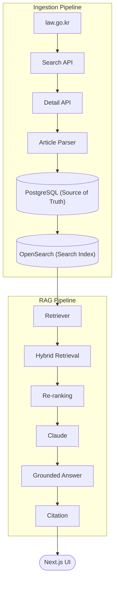

# Public Law AI

**Ask the AI Lawbot.** A backend-first, TypeScript RAG (retrieval-augmented
generation) platform that answers Korean legal questions with cited,
traceable sources — built in public, phase by phase, as a portfolio
project for AI Backend Engineer roles.

Most public RAG portfolio projects stop at "call an embedding API, stuff a
vector DB, prompt a model." This project asks a different question: what
does this look like as a backend an engineering team could actually own —
and as a product a user could actually trust? It picks a real, non-trivial
domain (Korean statutes, where an unsourced answer has real consequences)
and builds both the production-shaped backend and the polished product UI
around it. See [`docs/portfolio.md`](docs/portfolio.md) for the full
motivation and the AI Backend Engineer skills this project is built to
demonstrate.

## Screenshots

> Screenshots and a short product walkthrough are planned for this section
> (to be added under `docs/screenshots/` once captured).

- **Hero / landing** — brand, mascot, current legal coverage card
- **Ask flow** — question input, example questions, streaming answer
- **Grounded Answer** — inline citation highlighting, referenced articles,
  response time

## Release Status

**Status:** Phases 0–30 complete. Phase 23 closed the original portfolio
scope out with a final project-wide validation pass; Phases 24–30 extended
retrieval quality (real production wiring, BM25 optimization, vector +
hybrid + re-ranked retrieval, and a production benchmark framework with a
final benchmark report). The Next.js frontend (Hero, mascot, question/answer
flow, citation UI) has since gone through its own polish pass on top of this
backend.

Run the full release validation suite with:

```bash
pnpm validate:release
```

See [`docs/release.md`](docs/release.md) for the completed phase list,
validation strategy, known limitations, and future production
improvements, and [`docs/benchmark-report.md`](docs/benchmark-report.md)
for the final retrieval benchmark results and recommended configuration.

## Overview

This repository is not a chatbot demo. It is an enterprise-shaped backend
for a legal question-answering product — a typed domain model for statutes
and court cases, pluggable search/retrieval, a provider-agnostic AI layer,
a REST API surface, and cross-cutting observability, reliability, and
security foundations, all built so that every layer can be validated
in-memory, without any external service, API key, or running server —
fronted by a real Next.js product UI, not just a curl-able endpoint.

The project is developed in **phases**. Each phase adds one architectural
capability, ships with its own validation runner(s), and is documented
before the next phase starts. Nothing is marked "done" without a passing,
dependency-free validation script proving it.

## Core Features

- **Grounded Q&A** — every answer is generated from retrieved statute text
  via Claude, not from the model's memory alone, and is traceable back to
  its source article.
- **Inline + aggregated citations** — statute/article references (e.g.
  `제29조`) are highlighted directly inside the streamed answer, and
  summarized in a "Referenced Articles" panel.
- **Hybrid retrieval** — BM25 keyword search, vector search, and
  reciprocal-rank-fusion hybrid retrieval, with an optional re-ranking
  stage, all behind one `SearchEngine` interface.
- **Evaluation & benchmarking** — retrieval and grounding quality are
  measured, not assumed: precision/recall evaluators, a regression runner,
  and a production benchmark comparing every retrieval strategy on
  quality, grounding, and latency.
- **Production-shaped backend** — Clean/Hexagonal architecture, a single
  composition root, typed configuration, and observability/reliability/
  security foundations, all validated without external services.
- **Product-quality frontend** — a Next.js + Tailwind CSS UI (hero
  section, mascot, streaming answer, citation and confidence panels) —
  not just an API demo.

## How It Works

**Ingestion pipeline** (offline, run via `pnpm pipeline:*` / `pnpm
db:legal:*`):

```
law.go.kr → Search API → Detail API → Article Parser → PostgreSQL (Source of Truth) → OpenSearch reindex
```

**RAG pipeline** (per question, served by `POST /api/ask`):

```
Question → Retriever → BM25 / Vector / Hybrid search → Re-ranking → Prompt assembly → Claude → Grounded Answer → Citation extraction
```



See [`docs/rag-runtime.md`](docs/rag-runtime.md) for the full request trace,
[`docs/benchmark-report.md`](docs/benchmark-report.md) for how each
retrieval strategy performs, and
[`docs/data-flow.md`](docs/data-flow.md) for the end-to-end data flow
(including how OpenSearch is rebuilt from PostgreSQL if lost).

## Current Coverage

This prototype currently answers questions using the **Personal
Information Protection Act** (개인정보 보호법) and related regulations
indexed from law.go.kr. The ingestion and retrieval pipeline is
statute-agnostic — additional Korean statutes can be added through the
same pipeline without architectural changes.

## Project goals

- Demonstrate production-grade backend architecture for an LLM-powered
  product, not just a prompt wrapper around an AI API.
- Keep every layer swappable: fake/in-memory implementations back every
  interface today, with real implementations (OpenSearch, PostgreSQL,
  OpenAI, Anthropic) available behind the same interface.
- Make correctness verifiable without external dependencies — anyone can
  clone this repo and run the full validation suite with zero credentials,
  zero Docker, zero network access.
- Build and document incrementally, the way a real engineering team ships:
  small phases, explicit scope boundaries, and a paper trail of what each
  phase did and did not do.

## Technology Stack

| Concern | Technology |
|---|---|
| Language | TypeScript (strict mode) |
| Runtime / framework | Next.js 16 (App Router), Node.js |
| Frontend | React, Tailwind CSS v4 |
| Search | OpenSearch (keyword + hybrid + vector search engines) |
| Database | PostgreSQL (`pg`) |
| AI providers | OpenAI, Anthropic (`@anthropic-ai/sdk`), plus a deterministic fake provider |
| HTTP | A framework-independent HTTP abstraction, adapted to a Fastify-like server interface |
| Tooling | pnpm, ESLint, `tsx` (validation runners), Docker / docker-compose |

No external resilience, security, or observability library is used —
retry/timeout/circuit-breaker, rate limiting/input validation, and
logging/metrics/health-checks are all built as small, dependency-free
in-memory abstractions (see [Architecture](#architecture)).

## Architecture

The codebase follows **Clean / Hexagonal Architecture** with **Domain-Driven
Design** boundaries: a framework-independent domain and application core,
surrounded by interfaces ("ports"), with concrete adapters (JSON files,
PostgreSQL, OpenSearch, OpenAI/Anthropic, Fastify) plugged in at the edges
through composition — never imported directly by the core.

See [`docs/architecture.md`](docs/architecture.md) for the full write-up of
layering, module relationships, runtime flow, and dependency direction.

## Module Structure

All application code lives under `app/legal/*`, one directory per module,
each with its own `index.ts` barrel export. See
[`docs/modules.md`](docs/modules.md) for a description of every module;
the top-level shape is:

```
app/legal/
  domain/            canonical legal document types
  repository/        persistence-agnostic document access
  persistence/       JSON / PostgreSQL repository implementations
  pipeline/          ingestion from public legal data sources
  embedding/         chunking + embedding + vector indexing
  search/            search engine abstraction (keyword, hybrid, OpenSearch)
  retrieval/         Retriever abstraction consumed by RAG
  context/ prompt/   prompt context + prompt construction
  citation/ rag/     citation building + RAG answer assembly
  ai/                AI provider abstraction (OpenAI, Anthropic, fake)
  application/       use cases orchestrating the RAG flow
  api/               controllers + request/response DTOs
  http/              framework-independent HTTP abstraction
  server/            production server runtime + lifecycle
  composition/       the composition root (ApplicationContext)
  config/            typed application configuration
  evaluation/        quality/regression evaluation framework
  observability/     logging, metrics, health checks
  reliability/       retry, timeout, circuit breaker, error classification
  security/          rate limiting, input validation
  infra/             local Docker infrastructure validation
```

## Development Roadmap

The project is built phase by phase; each phase is scoped, validated, and
documented before the next begins. See
[`docs/development.md`](docs/development.md) for the phase strategy this
repository follows.

## Completed Phases

| Phase | Focus |
|---|---|
| 0 | Streaming legal chat walking skeleton |
| 2 | Legal domain model + minimal RAG architecture |
| 3–5 | Search engine abstraction, OpenSearch foundations |
| 6 | Production OpenSearch indexing |
| 7 | Hybrid search (keyword + vector, score fusion) |
| 8 | Embedding pipeline (chunking, embedding, vector indexing) |
| 9 | Production RAG (real retrieval → prompt → answer) |
| 10 | REST API platform (controllers, DTOs, error mapping) |
| 11 | Framework-independent HTTP adapter |
| 12 | Application composition root |
| 13 | AI provider layer |
| 14 | Real LLM integration (OpenAI, Anthropic) |
| 15 | Production configuration (typed, validated, env-driven) |
| 16 | Docker infrastructure (PostgreSQL, OpenSearch) |
| 17 | Production server runtime + graceful shutdown |
| 18 | End-to-end runtime validation |
| 19 | Evaluation & quality framework |
| 20 | Observability foundation (logging, metrics, health checks) |
| 21 | Security & reliability foundation (retry, timeout, circuit breaker, rate limiting, input validation) |
| 22 | Portfolio packaging (README, architecture/module/development/deployment/portfolio docs) |
| 23 | Final production release (release docs, project-wide validation) |
| 24 | Production RAG runtime integration (real OpenSearch retriever + real Anthropic provider wired into the composition root) |
| 25 | RAG evaluation against real production data (retrieval metrics, failure analysis, grounding metrics, unified report, regression evaluation) |
| 26 | BM25 retrieval optimization + benchmark |
| 27 | Embedding pipeline + vector retrieval |
| 28 | Hybrid retrieval (Reciprocal Rank Fusion) + benchmark |
| 29 | Re-ranking pipeline + benchmark |
| 30 | Production benchmark framework + final benchmark report (see [`docs/benchmark-report.md`](docs/benchmark-report.md)) |

Each completed phase has a corresponding doc under `docs/` and one or more
`pnpm validate:*` scripts that prove it in-memory.

## Validation Strategy

There is no test framework in this repository — instead, every phase ships
one or more **validation runners**: plain TypeScript scripts (`tsx
app/legal/**/run*Validation.ts`) that assert behavior with hand-rolled
`assertTruthy`/`assertEqual` helpers and exit non-zero on failure. Every
runner uses fake or in-memory implementations, so the entire suite runs
with **no PostgreSQL, no OpenSearch, no Docker, no OpenAI/Anthropic API
key, and no running server**.

Each module has its own validation script(s), and most modules also have a
milestone runner that sequences all of that module's validators and checks
that its own `package.json` scripts and docs exist (e.g.
`pnpm validate:evaluation`, `pnpm validate:observability`, `pnpm
validate:security-reliability`). See
[`docs/development.md`](docs/development.md) for the full workflow.

## How to Run

```bash
pnpm install

# Local development (Next.js dev server)
pnpm dev

# Type-check + lint
pnpm lint
pnpm build

# Run any module's validation suite (no external services required), e.g.:
pnpm validate:rag:e2e
pnpm validate:evaluation
pnpm validate:observability
pnpm validate:security-reliability

# Optional: local PostgreSQL + OpenSearch via Docker
cp .env.example .env
pnpm infra:up
```

See [`docs/deployment.md`](docs/deployment.md) for Docker/production
details and [`docs/configuration.md`](docs/configuration.md) for every
environment variable.

## Project Structure

```
app/legal/*         backend modules (see Module Structure above)
app/components/*    frontend UI components (hero, mascot, Q&A, citations)
app/api/ask/        the streaming RAG chat API route the frontend calls
data/sample/legal/  sample statute + court case data
docs/               one document per phase / architectural concern
docker-compose.yml Dockerfile   local infra + application image
```

## Future Improvements

- Bind a real socket-listening HTTP server to `ProductionServerRuntime`
  (currently composes the full application graph but does not yet listen).
- Wire `SecurityReliabilityService` and `ObservabilityService` into the
  actual request path (currently composed but not yet consumed by
  production runtime).
- Ranking metrics (MRR, NDCG) for retrieval/search evaluation.
- A standalone citation-accuracy evaluator.
- Authentication/authorization (explicitly out of scope through Phase 21).
- Real screenshots/walkthrough in this README (see
  [Screenshots](#screenshots)).

## Portfolio Highlights

See [`docs/portfolio.md`](docs/portfolio.md) for why this project exists,
the AI Backend Engineer skills it demonstrates, and interview talking
points.
