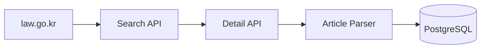
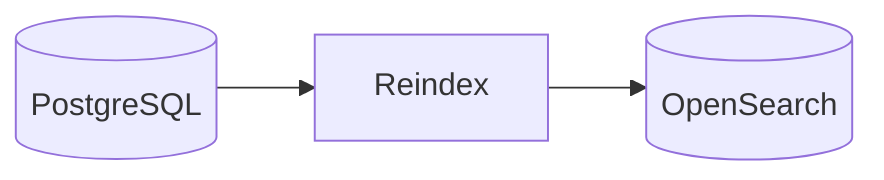
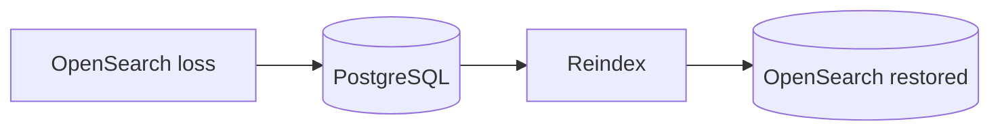

# Legal Data Flow

## 1. Purpose

This document is the map of how a Korean statute gets from law.go.kr into
an answer a user reads, and how the system recovers if the search index is
lost. It intentionally stays at the data-flow level — for module-level
detail see [`docs/architecture.md`](architecture.md), for the full RAG
request trace see [`docs/rag-runtime.md`](rag-runtime.md), and for
retrieval-strategy comparisons see
[`docs/benchmark-report.md`](benchmark-report.md).

Three facts govern every diagram below:

- **PostgreSQL is the Source of Truth.** Every article-level document
  ingested from law.go.kr is persisted to PostgreSQL first; nothing is
  considered durably stored until it lands there.
- **OpenSearch is a rebuildable search index**, not a second source of
  truth. It is always derived from PostgreSQL and can be fully rebuilt from
  it at any time (`pnpm db:legal:reindex`).
- **Additional statutes use the same pipeline.** The current deployment is
  scoped to the Personal Information Protection Act (see the README's
  [Current Coverage](../README.md#current-coverage) section), but ingesting
  any other Korean statute from law.go.kr is a query-parameter change to
  the same ingestion pipeline, not a new architecture.

## 2. Ingestion — law.go.kr to PostgreSQL

Run with `pnpm pipeline:law:search:postgres`. The search stage finds
statute ids for a query, the detail stage fetches each statute's full
text, and the article parser splits it into article-level documents that
are upserted into PostgreSQL.

## 3. Search Indexing — PostgreSQL to OpenSearch

Run with `pnpm db:legal:reindex`. This reads every document currently in
PostgreSQL and rebuilds the OpenSearch index from scratch — OpenSearch
holds no data that didn't come from this step.

## 4. Runtime RAG — Question to Grounded Answer

Served by `POST /api/ask`. Hybrid retrieval and re-ranking run against the
OpenSearch index built in §3; see
[`docs/rag-runtime.md`](rag-runtime.md) for the full request trace through
`RagController` → `GenerateRagAnswerUseCase` → citation extraction.

## 5. Recovery — Rebuilding OpenSearch After Loss

Because OpenSearch is always derived from PostgreSQL, losing the
OpenSearch index (data loss, index corruption, environment rebuild) is not
a data-loss event — it is a cache-miss event. Recovery is the same command
as §3: `pnpm db:legal:reindex` reads PostgreSQL and rebuilds the index. No
re-ingestion from law.go.kr is required.
